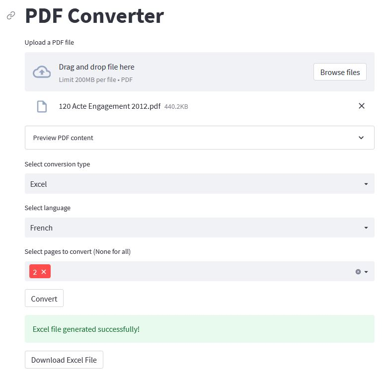

# PDF to text/Excel Converter

## Overview
This versatile web application allows users to convert PDF files to either text or Excel format. It features a user-friendly interface powered by Streamlit and leverages the pdf2image, pytesseract, PyPDF2, img2table, and paddleocr libraries for robust PDF processing capabilities.

## Prerequisites
Before running the application, ensure you have the following dependencies installed:

1. Python
2. Required Python packages: Install them by running the following command in your terminal:
   ```bash
   pip install -r requirements.txt

3. Poppler Installation (Windows/Linux):

   - Download and install Poppler from https://poppler.freedesktop.org/
   - Add the Poppler bin directory to your system's PATH environment variable. For example, on Windows, add "C:\Program Files\poppler-23.11.0\Library\bin" to the PATH.

4. Tesseract Installation:

   - For Windows: Download and install Tesseract from https://github.com/UB-Mannheim/tesseract/wiki
   - Add "C:\Users\name\AppData\Local\Programs\Tesseract-OCR" to the PATH environment variable.
   - For Linux: Follow the instructions at https://tesseract-ocr.github.io/tessdoc/Installation.html

## Usage
1. Execute the application using Streamlit with the command:
   ```bash
   streamlit run app.py


## Instructions

1. Upload a PDF file using the provided file uploader.
2. View a preview of the PDF content by expanding the "Preview PDF content" section.
3. Choose the desired conversion type: Text or Excel.
4. Select the language for the OCR process: English or French.
5. Choose specific pages for conversion or leave blank to convert the entire document.
6. Click the "Convert" button to start the conversion process.
7. After conversion, a download button will appear, allowing you to download the resulting text or Excel file.

## Features
- PDF preview: Users can view their PDF before conversion.
- Language selection: Supports OCR in English and French.
- Page selection: Convert specific pages or the entire PDF.
- Dual conversion: Choose between text or Excel output.
- Downloadable results: Easily download the converted files.


## Preview
Here is a preview of the application:
<details open>
<summary>preview</summary>

<div align="center">
    -
</div>

</details>